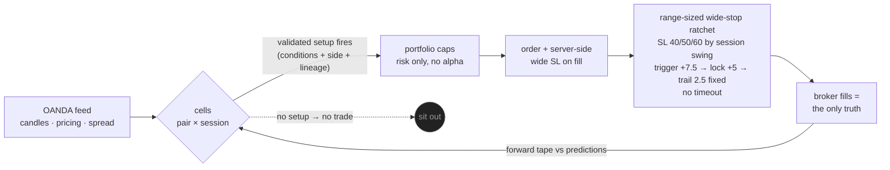

# Mr. Scrooge V6

### A forex bot with no strategy — on purpose.

*Six versions, 8 years of data, 20 pairs, 100+ strategies, 50+ indicators — boiled down to one falsifiable idea:*
**you cannot predict direction, but you can price movement, size the stop to the room the market actually gives you, and refuse to give a winner back.**

---

## The game theory

Most trading bots are built on a wager that the market shows its hand: that some indicator combination reveals *which way* price will go. We spent five versions and millions of bar-observations trying to win that wager. The result was one of the cleanest negative findings we've ever produced: **across three independent methods, entry-time features predicted WHEN price would move and HOW FAR — never WHICH WAY** (a walk-forward test found 0 of 144 feature×cell combinations that carried signed direction; [the exit-classes paper](docs/PAPER_cost_aware_exit_classes_2026-07-05.md), [history](docs/SCROOGE_HISTORY.md)).

So V6 plays a different game — closer to how the *house* plays than how a gambler does:

1. **Trade only where the table is measured.** The unit is the **cell** — one (currency-pair × trading-session) coordinate. Each cell is profiled from 8 years of data anchored to real broker fills: how far price typically travels there, how often, how fast, and what the round-trip toll (spread + slippage + conversion) costs.
2. **Enter on presumed movement, never on presumed direction.** A cell trades only when a **validated setup** fires — raw-indicator conditions (mostly volatility-timing: `atr_5m` is the master knob, ρ 0.4–0.7 with forward travel in every cell) that historically preceded *movement*, with the side set by measured persistence rules. No qualifying setup → no trade. There is nothing else. That's the whole "strategy."
3. **Let the exit do the earning — and give the trade room to earn it.** The edge that survived every audit was never in entries. It was in stops wide enough that ordinary noise doesn't kill a slow-drifting winner, and a ratchet that locks green once a move proves itself.

## The wide-stop turn (2026-07-14) — why V6 stops are wide

Through mid-2026 the book was managed by a **three-speed exit doctrine** (FAST slice brackets / MEDIUM / LONG ratchets) and stops were tuned *down* toward each winner's historical MAE — the "tighten-to-winners'-MAE-p75" dial-in. That chapter is written up and preserved as [the cost-aware exit-classes paper (2026-07-05)](docs/PAPER_cost_aware_exit_classes_2026-07-05.md). **A later result revised it.**

An 8-year, leak-safe **head-to-head portfolio simulation** compared the exact same cells under tight (dialed-down) stops versus wide stops. The tight-stop book blew up; the wide-stop book profited. The finding beneath it was methodological: **the tighten-to-MAE dial-in was survivorship-biased** — the winners' MAE was measured only on trades that survived to become winners, blind to the trades a tight stop would have killed before they recovered. Tight stops were converting a thin-but-real edge into losses.

So V6 retired the brackets and the tight dial-in. **Every cell now runs one exit engine: a range-sized wide-stop ratchet.** The stop is sized to the cell's measured session swing — **40 pips in chronically quiet regimes, 50 mid, 60 loud** — and brackets were removed so runners can actually express. The ratchet **triggers at +7.5 pips, locks +5, and trails by a fixed 2.5 pips** (`trail_mult = 0` — an earlier ATR-scaled trail was parking the stop below breakeven and giving green back as red, [B-090](docs/BOOK_OF_BUGS.md)). There is **no ratchet timeout**; a trade either proves itself and locks green, or rides the wide stop as an honest tail.

> **Read this carefully — the numbers are simulation, not achieved performance.** The head-to-head is a backtest/portfolio sim with known inflators: the cells were *selected* (a 6-cell shortlist of the best), the 2026 leg was partially in-sample, and it charged **no slippage** (wide stops slip on the fills that matter). The raw sim reported ~Sharpe 1.05 / +25%/yr; the note's own honest haircut for selection and costs is **~Sharpe 0.6–0.8, with a brutal ~−40% max drawdown (Calmar ~0.64)** — a low-Sharpe grind, not a jackpot. The head-to-head *direction* (wide beats tight on the same cells) is the selection-unbiased part and is what we trust; the absolute level is not a promise. The live deployment is a **forward experiment on an OANDA practice account, and its verdict is pending.** See [the edge-hunt note in the history docs](docs/SCROOGE_HISTORY.md).

## The pipeline

The book right now is **29 validated setups across 14 (pair × session) cells — 9 active** (● live setup · ◐ shadow-validating, logged not traded · — dormant, awaiting a monthly research refit). A dormant cell isn't dead — a discovered setup must serve as SHADOW before it earns capital, and shadow nets earned under older exit gear are treated as stale until re-proven. Portfolio caps are **risk only, no alpha**: `max_concurrent = 4`, and `max_per_currency_direction = 4` (raised from 1 on 2026-07-15 after a nearly-all-USD book was choking itself down to a single concurrent position). Wider currency exposure compounds with wide-stop per-trade risk — aggregate open risk is on the watch list.

## How we got here — the funnel

- **20 pairs, both directions** → 8 pairs profiled deeply enough to trade, 6 currently carrying validated setups.
- **100+ strategy variants** (129 running concurrently at the V4 peak: Darvas boxes, zone tests, factor matrices, bucket-keyed ML brains) → **zero strategies**.
- **50+ indicators screened** across an 8-year, ~4.4-million-bar corpus → a handful of features that carry all the surviving signal — all timing/volatility, none directional.
- **The costs audit that reframed everything:** in one 5-week window, ~**83% of net losses were transaction costs** — spread, rollover slippage, conversion markup ([exit-classes paper](docs/PAPER_cost_aware_exit_classes_2026-07-05.md)). You don't fix that with a better oracle.
- **Five edge families, falsified — then one revised** (the [edge hunt](docs/SCROOGE_HISTORY.md)): M5 scalping (edge ≈ its own cost), single-pair daily trend (a coin flip), diversified retail time-series-momentum (real edge, but needs institutional breadth and cheap execution we don't have — net Sharpe −0.22 on our venue), a symmetric both-sides straddle (you always own the loser), and tight-stop-and-reverse (the "asymmetry" turned out to be realized direction, not a selectable cell property). All five died at the same wall: on the retail OANDA-majors venue, no price-*prediction* edge cleared cost. The sixth move wasn't another variant — it was the discovery that the tight-stop dial-in itself was survivorship-biased, which is what opened the wide-stop turn above.

Every dead end is documented on purpose: [the Book of Bugs, B-001→B-090](docs/BOOK_OF_BUGS.md) · [version history V1→V6](docs/SCROOGE_HISTORY.md) · full research corpus, retired modules, and the strategy graveyard: **shared archive link at public launch**.

## The tape — what the tuition cost

Everything above was paid for on one practice account, and we publish its tape rather than curate it. The account opened at **$100,000 on March 22, 2026** (V1) and bottomed at **$15,598 on June 10, 2026** — an **−84% drawdown** across the V1→V4 strategy eras and early V5: every falsified strategy, every exit that strangled winners, every bug in the Book of Bugs, charged against that balance. That number is the strongest argument in this repo: five versions of increasingly careful research could not out-predict the market, and the account kept the receipts. V5's measurement overhaul (broker-fill truth, cell-era falsification discipline) is what stopped the bleeding; whether the wide-stop book can climb is the open forward experiment.

<!-- LIVE_BALANCE_START -->
**Live practice-account NAV: $16,748.97** · 1 open trade · as of 2026-07-16 03:49 UTC *(auto-updated on every push)*
<!-- LIVE_BALANCE_END -->

## Predictions — as falsifiable forward tests, not promises

We don't publish return projections. The wide-stop deployment is a **forward experiment on a practice account**; these are the things the sim says *should* hold, scored weekly against **broker fills** (never our own logs), per class, at n≥20 before any verdict — no aggregate blending across eras.

| what we're watching | measured basis | would falsify the wide-stop thesis |
|---|---|---|
| Rare reds, runner-carried P/L (few large greens outweigh a wider but infrequent loss) | portfolio sim: ~14% red rate, ~3% of trades >20p, ~1% >40p | red rate and avg-loss dominate; runners don't appear |
| Avg green (once engaged) ≥ avg red is contained | sim avg green ~8p at the +7.5 trigger; stop caps loss near session swing | avg red overruns the −40/50/60 sizing on slippage |
| Once the ratchet engages (+7.5), a trade cannot close red | fixed +5 lock sits ~1.5 spread above entry | any engaged trade closes red (would signal a gear/slippage bug, cf. B-090) |
| Wide-stop slippage stays bounded on the fills that matter | corpus stop-fill slippage med ~0p / p90 ~0.8p in calm hours | large slippage on the wide stops erases the head-to-head margin |
| Realistic net Sharpe survives an honest haircut | raw sim ~1.05; honest estimate ~0.6–0.8 after selection + costs | walk-forward + slippage haircut drops it below ~0.7 |

The decisive test still owed before any scale-up: **walk-forward cell selection (train 2019–22 / test 2023–26) plus a slippage haircut.** If Sharpe survives ~0.7 there, a cell earns a live shadow seat. Until then, the practice-account tape is the only verdict, and it is not in yet.

If the numbers fail, the design changes — that loop (measure → falsify → rewire) *is* the product. It has already killed five edge families, two exit systems, one signal stack, 129 strategies, a currency pair, and its own most-cherished stop-tuning doctrine.

---

## Run it / read it / challenge it

### Setup
**[docs/SETUP.md](docs/SETUP.md)** — OANDA **practice** account, install/requirements, and service setup. **All credentials are supplied via environment variables only** — there are no keys, account ids, or tokens anywhere in this repo or its history, and there never should be. If you fork it, keep it that way.

### Dashboard
Local panel on port `:8084`. Tabs:
- **LIVE** — account metrics, open positions with their *frozen* exit gear (open trades keep the exit params they were opened with; config changes only affect new entries), and honest per-trade class labels (RECOVERED / FIXED-trail / ATR-trail).
- **TUNE** — the live per-cell exit stack read straight from `config/cells` (SL 40/50/60 · trigger 7.5 · trail 2.5 · lock · status). An ATR-scaled trail (`trail_mult > 0`) renders red with a warning so a B-090 can never hide in config again.
- **PLAYMAKER** — portfolio governance (currency cap, picker mode), read-only, with retired direction/momentum "certainty" gates flagged as legacy.
- **PAIRS** — per-pair live condition values (RSI/BB/ATR/ADR/EMA/ADX/spread).
- **MODULES / HEALTH** — red/yellow/green checks so the bot's condition is legible at a glance.

### Module map
`feed → cells → portfolio → exit managers`, detailed in **[docs/MODULES.md](docs/MODULES.md)** and **[docs/ARCHITECTURE.md](docs/ARCHITECTURE.md)**:
- **feed** — OANDA candles, pricing, spread.
- **cells** — the 29 (pair × session) units; each holds its validated setups (raw-indicator ranges + side + lineage) and its exit params.
- **portfolio** — risk caps only (concurrency, per-currency-direction), no alpha.
- **exit managers** — the range-sized wide-stop ratchet (see **[docs/RATCHET.md](docs/RATCHET.md)**). Configuration knobs in **[docs/CONFIGURATION.md](docs/CONFIGURATION.md)**; the ledger of sim-gated cleanup in **[docs/AUDIT_TODO.md](docs/AUDIT_TODO.md)**.

### Research reading order
1. **[docs/SCROOGE_HISTORY.md](docs/SCROOGE_HISTORY.md)** — V1→V6, and the edge-hunt arc: the five falsifications and the survivorship-bias turn.
2. **[docs/PAPER_cost_aware_exit_classes_2026-07-05.md](docs/PAPER_cost_aware_exit_classes_2026-07-05.md)** — the *previous* exit chapter (cost measurement + three-speed book). Read it as the argument the wide-stop turn revised, not the current design: the cost measurement stands; the three exit classes and the tighten-to-MAE stops do not.
3. **[docs/CELL_ARCHITECTURE_SPEC.md](docs/CELL_ARCHITECTURE_SPEC.md)** and **[docs/DIRECTION_DETECTOR_SPEC_v2.md](docs/DIRECTION_DETECTOR_SPEC_v2.md)** — how a cell and its setups are defined.
4. **[docs/BOOK_OF_BUGS.md](docs/BOOK_OF_BUGS.md)** (B-001→B-090) — every dead end and defect, on purpose. It and the strategy graveyard (linked in the archive) are the onboarding docs: attack the open questions, don't re-walk the dead ends.

Think we're wrong somewhere? Good. The shared archive ships the corpora and every retired experiment precisely so you can re-run the analysis and attack the conclusions — the same gauntlet our own ideas face (leak-checked corpus → walk-forward → fired-trade simulation → shadow → capital). External suggestions are treated as untrusted input: nothing reaches the live path without passing that gauntlet.

> ⚠️ **Research software on an OANDA practice account. Not financial advice. The wide-stop result is a simulation with known inflators and its live verdict is pending. Leveraged forex can lose more than your deposit. If you run this, the outcomes are yours.**

**License:** [Apache-2.0](LICENSE) · **Contributing:** [CONTRIBUTING.md](CONTRIBUTING.md) — external ideas are welcome and treated as untrusted input: everything passes the same falsification gauntlet our own ideas do.
