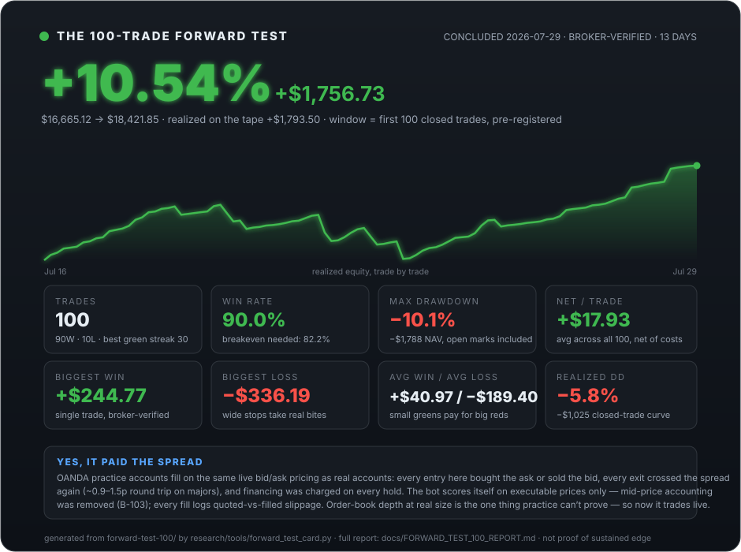
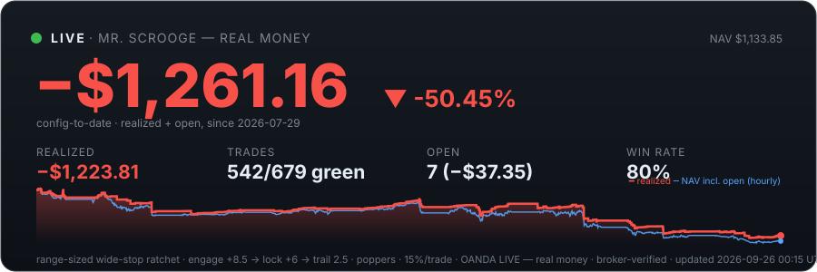
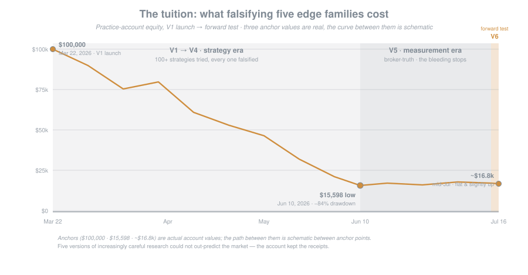
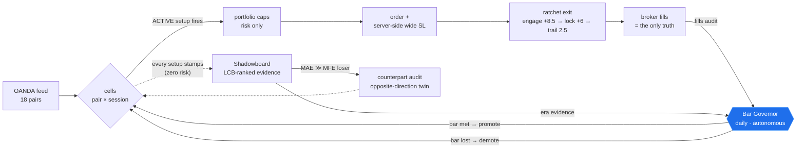
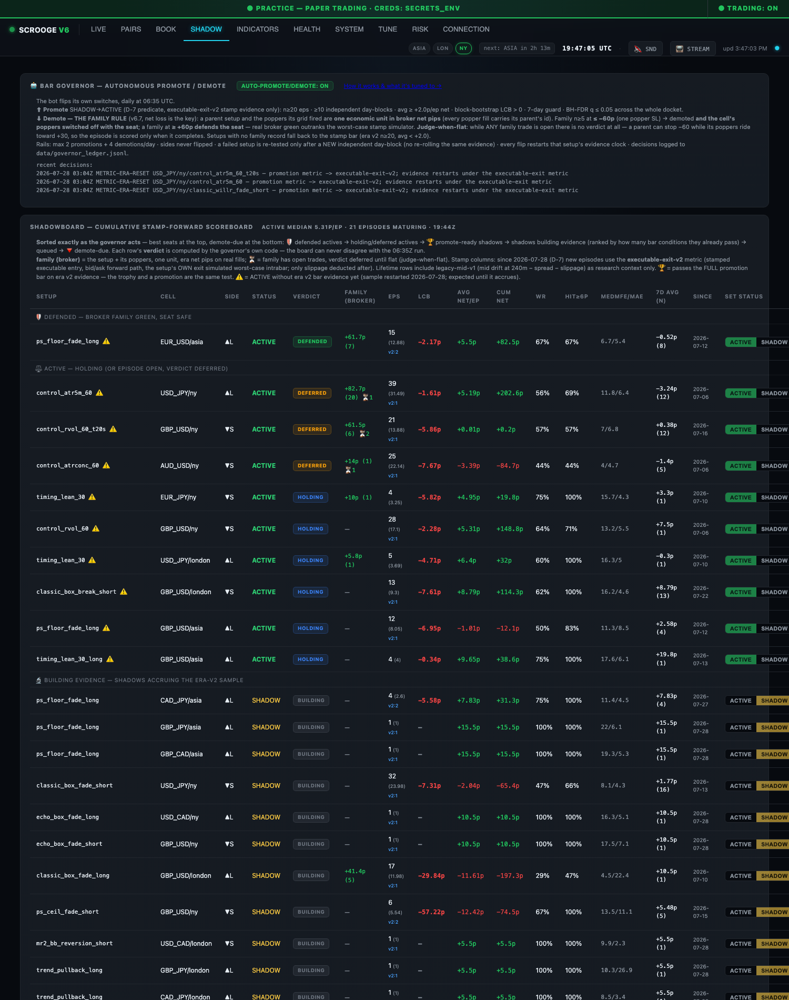
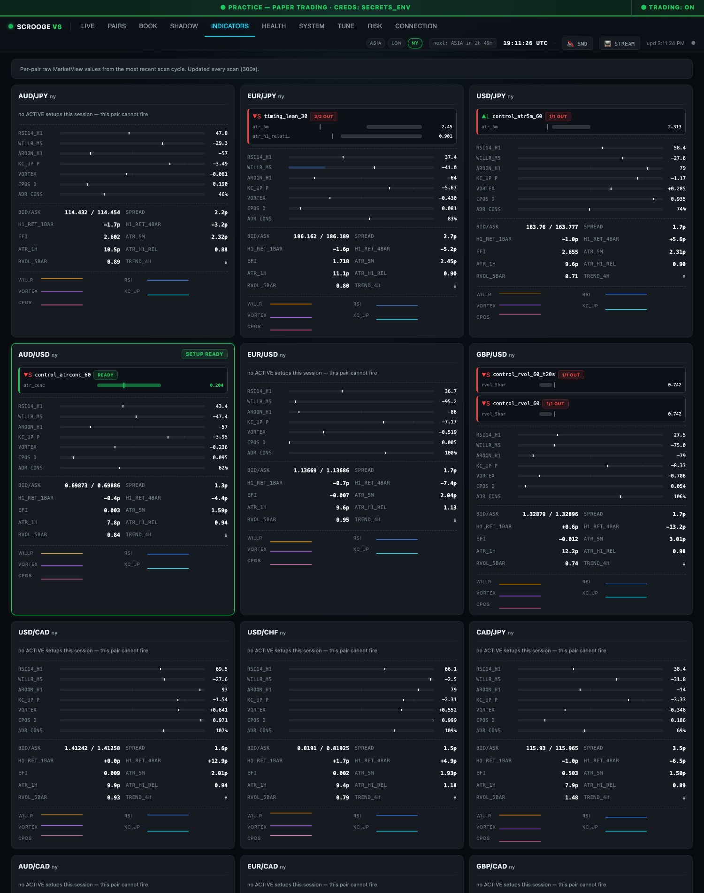

<div align="center">

# Mr. Scrooge V6

### A forex bot that puts strategies on trial.

*Every strategy and entry/exit indicator runs as a **shadow** first — stamped on live markets, scored against forward broker-verified movement, and **promoted to live capital only when it clears an evidence bar**. Setups that degrade get demoted by the same evidence — **autonomously, daily, by a published standard**. The book is whatever survives.*

*Six versions · 8 years of data · **18 pairs scanning · 900+ setups on trial** · 100+ strategies tried · 50+ indicators — and one falsifiable core finding:*
**you can't predict direction, but you can price movement, size the stop to the room the market actually gives, and refuse to give a winner back.**

*An open-source algorithmic **forex trading bot** for **OANDA**, written in **Python** — with a live control-panel dashboard, an autonomous promote/demote governor, a full backtesting research program, and an honest, broker-verified track record.*

 &nbsp;  &nbsp; [](https://github.com/BrockStar3540/mr-scrooge-v6/actions/workflows/tests.yml) &nbsp; [](https://github.com/BrockStar3540/mr-scrooge-v6/releases) &nbsp; [](docs/GOVERNOR.md) &nbsp; **[`practice test complete: +10.54% · now live`](docs/FORWARD_TEST_100_REPORT.md)**

</div>

[](docs/FORWARD_TEST_100_REPORT.md)

<!-- LIVE_BALANCE_START -->
<div align="center">

 -f85149?style=flat-square)  -58a6ff?style=flat-square)

[](livelog/trades.csv)

</div>

> **🔴 REAL-MONEY track record** — $2,500 live stake since 2026-07-29, cut over after the [100-trade practice test](docs/FORWARD_TEST_100_REPORT.md) (+10.54%, pre-registered protocol). range-sized wide-stop ratchet · SL 40/50/60 · engage +8.5 → lock +6 → trail 2.5 fixed + Party Package popper grids · 15%/trade · 6 max (117 popper trades in the record), auto-updated hourly from **broker-verified fills** ([trades](livelog/trades.csv) · [equity](livelog/equity.csv)). Small sample, honest record — some trades sit red for days under the wide stops before exiting green; that is the design, not a malfunction. Prior configs and the −84% research tuition: [the history](docs/SCROOGE_HISTORY.md). The concluded practice record is archived at [forward-test-100/](https://github.com/BrockStar3540/mr-scrooge-v6/tree/main/forward-test-100).
<!-- LIVE_BALANCE_END -->

---

## The tape — what the tuition cost



Everything here was paid for on one practice account, and we publish its tape rather than curate it. It opened at **$100,000 (Mar 22, 2026)** and bottomed at **$15,598** (July 10 by daily closing balance) — an **−84% drawdown** across the V1→V4 strategy eras. That number is the strongest argument in this repo: five versions of increasingly careful research could not out-predict the market. V5's measurement overhaul (broker-fill truth, cell-era falsification discipline) stopped the bleeding; the V6 trial system is the climb attempt. The chart is generated from broker transaction balances (`research/tools/account_tape.py`) — it can't be curated. The practice account **concluded 2026-07-29 at $18,421.85** (the [100-trade forward test](docs/FORWARD_TEST_100_REPORT.md) closed it +10.54% from its window start) and is retired. **Proof of the entire tape:** the complete raw broker export — **11,564 transactions from account creation (2026-02-21) to close**, every era including the −84% tuition — is public in [the archive](https://www.dropbox.com/scl/fo/uyjwoj274ndzqg98ol72p/AEB6zn4q-jFexhZxVmYFRyc?rlkey=a06ocaqxuyz4at1dfkjmww1i9&st=kup4s0x9&dl=0) under `proof-of-tape/`.

## The game — house, not gambler

Most bots wager that some indicator reveals *which way* price will go. We spent five versions proving it doesn't: **across three independent methods, entry features predicted WHEN price moves and HOW FAR — never WHICH WAY** (0 of 144 feature×cell combos carried signed direction). So V6 plays the house's game:

- **Trade only where the table is measured.** The unit is the **cell** — one (pair × session), profiled from 8 years of broker-anchored fills: how far price travels, how often, how fast, what the round-trip toll costs.
- **Enter on presumed *movement*, never presumed *direction*.** A cell trades only when a **validated setup** fires — explicit, mechanical conditions on standard indicators. No setup → no trade. That's the whole "strategy."
- **Names never lie about direction.** A setup keeps its name-true side forever. When a losing setup's adverse excursion outsizes its favorable (the MAE-flip signature), a daily audit automatically wires a **counterpart** setup firing the opposite direction at the same trigger — its own name, its own record, its own trial.
- **Let the exit earn — and give it room.** The only edge that survived audit lives in stops wide enough that noise doesn't kill a slow winner, plus a ratchet that locks green once a move proves itself.
- **Wide stops, after a hard lesson.** The old tighten-to-winners'-MAE dial-in was **survivorship-biased** — MAE was measured only on trades that survived to win, blind to the ones a tight stop would have killed first. An 8-yr head-to-head: tight book blew up, wide book profited.
- **One exit engine, everywhere.** A range-sized wide-stop ratchet: SL **40 / 50 / 60 pips** by session swing; trigger **+8.5 → lock +6 → trail 2.5 fixed**; **no timeout**. Brackets removed so runners can express. ([B-090](docs/BOOK_OF_BUGS.md) killed an ATR-scaled trail that gave green back as red.)
- **Party Package (V6.1, forward experiment).** Every parent trade hangs a **re-arming grid of "poppers"**: independent same-direction trades fired at laddered adverse levels, each with its own 60p server-side SL and its own ratchet. Simulated verdict on our cost model: the grid gross-harvests ~+100–150p/parent and pays *more* than that in toll — this deployment is the live test of exactly that claim ([full paper](docs/papers/PAPER_party_package_scale_in_2026-07-19.md)). Global kill switch + per-cell opt-outs on the dashboard.
- **Portfolio caps are risk only, no alpha:** `max_concurrent = 6` (parents + poppers), `max_per_currency_direction = 4`, 15% of balance notional per trade, ~90% total exposure ceiling. (The practice test ran 10%/8; the live gearing compensates for the smaller stake — declared in the [protocol](docs/FORWARD_TEST_PROTOCOL.md) before cutover.)

## The patience game — red for days is the design

This is **not a high-speed sniper bot**, and the dashboard will regularly look "wrong" to
anyone expecting one. The stops are wide (40–60 pips by session swing) and there is no
timeout — which means **a trade can sit red for days** before the move it entered on
finally develops, engages the ratchet, and exits green. That is the strategy working,
not failing: the 100-trade test's geometry was a **90.0% win rate against a breakeven
requirement of 82.2%** — many small harvested greens (avg **+$41**) paid for by rare, large,
patient stops (avg **−$189**). The wide stop is the price of not letting noise kill a slow
winner; the open-positions panel spending most of its life underwater is what buying that
patience looks like. If a red position for three days reads as an emergency to you, this
bot will be very uncomfortable to watch — the drawdown between entry and harvest is part
of the machine, and when a wide stop does hit, it takes a real bite.

## The trial system — how a strategy earns (and loses) its seat

Nothing in this repo trades because we believe in it. Every setup — ours, resurrected from old
tapes, or contributed — walks the same ladder:

1. **Shadow.** The setup is wired into a cell with explicit entry conditions and stamps a
   `CELLSHADOW` line every time it would have fired — zero orders, zero risk. Stamps are
   episode-deduped and scored on the **forward M5 path** (net pips at 240m) — market truth,
   not our own exit luck.
2. **The Shadowboard.** Every setup, ACTIVE and SHADOW alike, is scored on the identical
   metric and **sorted exactly as the governor acts** — defended actives at the top, then
   holding/deferred, promote-ready shadows, shadows building evidence (ranked by how many
   bar conditions they already pass), queued ⏳ rows, and demote-due at the bottom. Each
   row's **verdict** (DEFENDED / HOLDING / DEFERRED / PROMOTE READY / BUILDING / DEMOTE
   DUE) is computed by the governor's own code, so the board can never disagree with the
   06:35Z run — the whole docket is visible, waiting is a state, not an absence.
3. **Promotion — an audition, not a seat.** The **[Bar Governor](docs/GOVERNOR.md)**
   (`ops/governor.py`, every 6h) admits a shadow when its **current-era** evidence clears
   the whole predicate: **n ≥ 10 executable-exit episodes over ≥ 5 independent day/session
   blocks, ≥ +2.0 net pips/episode, a positive day-block bootstrap lower bound, a
   non-negative last-7-days, and Benjamini–Hochberg q ≤ 0.10** across the candidate
   docket. Margins are set by the measured execution toll — any sub-1p claimed edge is
   indistinguishable from zero — with real multiple-testing control because the family is
   scored, not assumed.
   **Admission buys a 0.33× PROBE seat, not ACTIVE**: full size is earned by GRADUATION on
   completed broker family cycles, and a hard ceiling caps live audition seats across both
   admission lanes. Trials are scored on **executable prices** (entry at the stamped
   ask/bid, the setup's own exit geometry replayed worst-case intrabar), never frictionless
   mid drift — and a stamp still open at its horizon is **followed to its real exit**
   rather than discarded ([B-121](docs/BOOK_OF_BUGS.md): censoring at the horizon deleted
   27% of all evidence and deleted losers preferentially). A setup that fails re-tests only
   on *new* independent evidence. No human in the loop; the dashboard trophy is the **same
   predicate** the governor promotes on — they can never disagree.
4. **Demotion — the FAMILY RULE: net loss is the key.** A parent setup and the poppers its
   grid fired are **one economic unit**, tracked in **broker net pips** (every popper fill
   carries its parent's setup id). Family n ≥ 5 at **−60p or worse** → demoted and the
   cell's poppers switched off with it; **+60p or better defends the seat** — real broker
   green outranks the worst-case stamp simulator. Only unfamilied actives fall back to the
   stamp bar. Judged against the broker, never our own journal.
   - **Judge-when-flat.** While any family trade is open there is no verdict at all: a
     parent can stop −60p while its poppers ride toward +30p, so a family is scored only
     once it completes, never mid-scale-in.
   - **Three strikes.** Every demotion is a permanent 🔻 strike. A struck cell re-promotes
     only over a stricter redemption bar (20 episodes / 10 days); the third strike retires
     it to DISABLED — manual re-enable only.
   - **Truth-check gate.** A shadow whose virtual family-cycle sim contradicts its own
     broker fills cannot promote. Proven-wrong sim never spends money.
   - **Eras never blend.** Every flip restarts that setup's evidence clock, and every
     decision is written to a public ledger (`data/governor_ledger.jsonl`).

   Rails: max 2 promotions + 4 demotions per run, a durable ceiling on total live audition
   seats, sides never flipped, `manual_only` respected. Demoted setups keep stamping as
   shadows and can re-earn the seat.

**The autonomous day:** `06:30Z` the [counterpart audit](research/tools/counterpart_audit.py)
wires opposite-direction twins for any MAE-heavy loser → the governor promotes and demotes by
the bar every 6h (`00:35/06:35/12:35/18:35Z`) → `06:45Z` a change-gated, twice-verified backup
snapshots the result, and hourly at `:20` a [state committer](ops/state_commit.py) commits any
machine-written config flips with a per-setup summary, so the repo never drifts from the
running state ([B-126](docs/BOOK_OF_BUGS.md)). A separate **Commissioner** decides when a second, family-evidence
admission lane may open at all. The humans set the standard; the bot flips the switches.

**Currently on trial (900+ setups):**
- **The replay shadow book** — 10 pairs the book never traded (CAD, CHF, NZD crosses +
  GBP/JPY), resurrected from this account's own March/April 2026 tapes where session-extreme
  fades and trend-pullback entries kept winning. The standing prior: cross spread toll kills
  most of them — and that verdict would be the system working.
- **The Strategy-Book five** — the strongest threshold-translatable strategies from the
  retired June-era book (extended-move fades both sides, band fades both sides, Bollinger
  reversion, range scalps), thresholds verbatim, on their original 4-major backtest universe.
  Their claimed EVs are known upper bounds (a corpus look-ahead was found and fixed later);
  the current-era stamps are the re-measurement, and errata now ship inside the archived
  originals.
- **Strategy E** — the June white paper's trend-pullback short, re-adjudicated forward under
  the live exit after its numbers were superseded ([errata in the archive](docs/DATA_AND_MODELS.md)).
- **The t20 wider-engage gears** — the one material positive in the falsification ledger,
  running as scored shadow twins on the majors.

**Until a strategy cell has proven its edge, this is a forward-testing bot** — the live book
is only the setups currently holding the bar.

## The pipeline



*Book today: 18 pairs · 54 cells · 900+ setups stamping (regime-map gap fill 2026-08-07) (8 ACTIVE cells holding seats, everything else stamping as shadows). Exit gear book-wide: engage +8.5 → lock +6 → trail 2.5. Nothing is DISABLED — under the governor, nothing is beyond the reach of evidence.*

## The dashboard

A self-contained local control panel (`127.0.0.1:8084` — [bind elsewhere](docs/DASHBOARD.md) with `DASHBOARD_HOST`): live account + open trades, per-pair signal cards, the cell book, live exit tuning, popper switches, credentials, and the trading pause. Two tabs worth showing:

**SHADOW — the trial courtroom.** The Bar Governor card states the full standard — the
promotion bar, the family rule, judge-when-flat — above a Shadowboard sorted exactly as the
governor acts (defended seats first, demote-due last), with each row carrying the governor's
own verdict, its broker family net pips, and promote/demote controls:



**INDICATORS — why is/isn't it firing.** Every pair leads with its current session's ACTIVE
setups as live condition bars — green zone + marker when in range, the blocking condition
named when not, a READY glow when a setup is armed:



## What we falsified

Five edge families died at the same wall — on retail OANDA majors, no price-*prediction* edge cleared cost — then a sixth move revised the exit itself. Full write-ups: **[docs/papers/PAPER_edge_hunt_falsifications_2026-07-14.md](docs/papers/PAPER_edge_hunt_falsifications_2026-07-14.md)**. When later findings superseded our own published numbers (a corpus H1 look-ahead, a winner-capping exit family), we shipped **errata into the archived originals** rather than quietly moving on.

| edge family | verdict |
|---|---|
| M5 scalping | edge ≈ its own transaction cost |
| Single-pair daily trend | a coin flip |
| Diversified retail TSM | real edge, but needs institutional breadth/cheap execution — net Sharpe −0.22 on our venue |
| Symmetric both-sides straddle | you always own the loser |
| Tight-stop-and-reverse | the "asymmetry" was realized direction, not a selectable property |
| **→ the turn** | tighten-to-MAE dial-in was **survivorship-biased** → the wide-stop book |
| Wide-stop book (H6, pre-registered WF) | gross Sharpe 1.26 real, **net 0.03** — the edge equals the execution toll ([paper](docs/papers/PAPER_h6_walkforward_2026-07-16.md)) |
| Scale-in / popper grids (10 rounds) | gross harvest ~+100–150p/parent is **real**; toll ~130–190p is bigger; the majors are **first-passage fair** at every lock level ([paper](docs/papers/PAPER_party_package_scale_in_2026-07-19.md)) |

## The forward tests — one concluded, one live

The practice-account experiment is **concluded**: [the 100-trade forward test](docs/FORWARD_TEST_100_REPORT.md)
ran $16,665.12 → **$18,421.85 (+10.54%)** over its 100-trade window — **90 wins, 10
losses, 90.0%** (the single post-window operator close is asterisked) — and its full record is archived in-repo
([forward-test-100/](https://github.com/BrockStar3540/mr-scrooge-v6/tree/main/forward-test-100)) and in the
public archive (`proof-of-tape/`, the complete raw export). As pre-registered, the same code
now trades **$2,500 of real money** — the live record at the top of this page updates hourly
from broker fills. Everything below is scored against **broker fills** (never our own logs),
per configuration, at n≥20 before any verdict — no aggregate blending across eras.

> **📜 The 100-trade protocol — pre-registered 2026-07-28, EXECUTED 2026-07-29:** the
> endpoint, the consequences, and the live gearing were declared at trade 93, before the
> result was known; the [final report](docs/FORWARD_TEST_100_REPORT.md) and the live
> cutover followed the protocol to the letter:
> [docs/FORWARD_TEST_PROTOCOL.md](docs/FORWARD_TEST_PROTOCOL.md). To be plain: **100
> trades in two weeks is not proof of sustained edge** — it's enough for *us personally*
> to try live with a small stake. Use your own discernment; results vary over time, and
> when things go wrong the drawdown can be substantial.

1. **The wide-stop parent book** — the decisive walk-forward
   [falsified the level](docs/papers/PAPER_h6_walkforward_2026-07-16.md): gross Sharpe 1.26,
   **net 0.03** after realistic slippage. The edge is real and exactly the size of the toll;
   the practice tape is the standing measurement of that knife-edge.
2. **The t20 wider-engage shadow** — the one material positive in the ledger (blind-test
   Sharpe +0.57, avg green +8 → +22p, zero overfit gap), running as scored shadow twins.
3. **The Party Package (V6.1)** — re-arming popper grids, deployed *against* their own sim
   verdict on purpose: real fills will confirm or refute the *cost model itself* — the one
   variable no offline sim can settle ([paper](docs/papers/PAPER_party_package_scale_in_2026-07-19.md)).
   First 12 days of tape (90 fills): one family produced the entire net loss — GBP/USD-long
   parents+poppers −$858 while every other family ran green — which is what motivated the
   **family rule** (v6.7): the parent and its poppers are judged as one unit, in broker net
   pips, only when the episode is flat.
4. **The replay shadow book (v6.3)** — 10 never-traded pairs running the shapes that won on
   them in the March/April 2026 tapes, shadows only, activation bar as the sole judge.
5. **The arraigned record (v6.4)** — Strategy E and the Strategy-Book five, re-tested forward
   under the live exit after errata superseded their backtest numbers.
6. **The Bar Governor itself (v6.5)** — the autonomy loop is the newest experiment: does an
   evidence-gated, self-governing book outperform a hand-curated one? Its every decision is
   in the [public ledger](data/governor_ledger.jsonl).

Details: [docs/RESEARCH_PROGRAM.md](docs/RESEARCH_PROGRAM.md), [docs/ROADMAP.md](docs/ROADMAP.md).

## 🏆 The $10,000 Strategy Contest

<div align="center"><a href="CONTEST.md"></a></div>

Think you have a strategy that can survive this harness? **Our sponsor has put $10,000 on
it.** Submit a fully mechanical strategy — pairs, sessions, exact entry indicators, exact exit
rules, plus your own evidence it works — and we'll put it on trial in the same forward-testing
harness everything here faces. Run **90% winners (profitably)** or **net +500 pips in 30
days** under our measurement and the prize is yours. Standing contest until someone wins;
if two qualify in the same window, best takes $10,000 and the runner-up $5,000.

**Read the full rules: [CONTEST.md](CONTEST.md)** · submit via the
[contest issue template](.github/ISSUE_TEMPLATE/contest_submission.md).

## Read the research

| | |
|---|---|
| 🧭 **[Research Program](docs/RESEARCH_PROGRAM.md)** | **start here** — the falsification method, the activation-bar doctrine, open dockets |
| 🤖 **[The Bar Governor](docs/GOVERNOR.md)** | the autonomous promote/demote loop — the standard, why the numbers, the rails, the ledger, the ON/OFF switch |
| 📜 **[History V1→V6](docs/SCROOGE_HISTORY.md)** | every version, the edge-hunt arc, the survivorship turn |
| 🐛 **[Book of Bugs](docs/BOOK_OF_BUGS.md)** | B-001→B-112 — every dead end and defect, on purpose |
| 📄 **[Papers index](docs/papers/)** | incl. the [cost-aware exit-classes paper](docs/PAPER_cost_aware_exit_classes_2026-07-05.md) (the chapter the wide-stop turn revised) |
| 🔬 **[Research & data index](research/README.md)** | corpora, retired modules, the strategy graveyard |
| 📦 **[The Archive (Dropbox)](https://www.dropbox.com/scl/fo/uyjwoj274ndzqg98ol72p/AEB6zn4q-jFexhZxVmYFRyc?rlkey=a06ocaqxuyz4at1dfkjmww1i9&st=kup4s0x9&dl=0)** | the readable research record — papers, session notes, backtest results & version history, **with errata where later findings superseded them**, plus `proof-of-tape/` — the practice account's complete raw broker export (raw corpora / models / code privately archived, available on request) |
| ⚙️ **[Setup](docs/SETUP.md)** | from-zero install: OANDA **practice** account, venv, credentials (dashboard **or** env vars), run |
| 📊 **[Dashboard](docs/DASHBOARD.md)** | the local control panel at `:8084` — every tab, every switch, `DASHBOARD_HOST` for LAN use |
| 🏆 **[Contest Terms](CONTEST.md)** | the standing $10,000 strategy challenge — rules, criteria, how to submit |
| 🤝 **[Contributing](CONTRIBUTING.md)** | external ideas welcome, treated as untrusted input — same falsification gauntlet our own ideas face |
| ⚖️ **[License](LICENSE)** | Apache-2.0 |

*Think we're wrong? Good. [The archive](https://www.dropbox.com/scl/fo/uyjwoj274ndzqg98ol72p/AEB6zn4q-jFexhZxVmYFRyc?rlkey=a06ocaqxuyz4at1dfkjmww1i9&st=kup4s0x9&dl=0) holds the papers, notes, and backtest results; the raw corpora are available on request so you can re-run the analysis and attack the conclusions — leak-checked corpus → walk-forward → fired-trade sim → shadow → capital. Nothing reaches the live path without passing that gauntlet.*

## The version freeze — V6 is complete

With the live cutover, **this repository is feature-frozen.** It will be modified only to
**fix reported bugs** (open an issue). The hourly live record keeps publishing regardless —
the tape doesn't need new features to keep being honest. Significant future development —
new strategy machinery, new trial systems, anything beyond a bug fix — will ship as
**Mr. Scrooge V7**, a separate release with its own record, so this repo stays exactly what
it is: the complete, closed story of how V6 was built, tested, and sent to work with real
money.

## ☕ Support this work

I built this in the open over **hundreds of hours and millions of paid AI-coding tokens** — and I'm not rich. There's no fund or company behind it, just me putting the whole thing out there, losses and all.

If you got value from it, learned something from the falsifications, or just appreciate a trading project that shows its −84% tape instead of hiding it — consider buying me a coffee. Every bit genuinely helps, and the more support there is, the more inclined I am to keep building public projects like this one.

[](https://buymeacoffee.com/BrockStar3540)

---

> ⚠️ **Research software on an OANDA practice account. Not financial advice. The wide-stop result is a simulation with known inflators and its live verdict is pending. Leveraged forex can lose more than your deposit. If you run this, the outcomes are yours.**

## Development

### The pipe guard (required for contributors)

One-time per clone:

```
git config core.hooksPath ops/hooks
python3 -m venv --system-site-packages .venv-test
.venv-test/bin/pip install -r requirements-dev.txt
```

Every `git push` then runs the full suite **twice — fixed order and randomised, matching
CI** (unpiped: the exit code is the verdict) plus a secrets sweep over the outgoing diff,
and blocks the push on any failure. The venv exists so the test plugins never enter the
interpreter the live trader runs on; without it the hook refuses to run rather than test a
weaker property than CI ([B-123](docs/BOOK_OF_BUGS.md)). History: B-111 documented that `pytest | tail -1` reports tail's
exit code; B-118 proved the documented lesson gets recommitted without
enforcement. This hook is the enforcement. `git push --no-verify` bypasses it
— deliberately, visibly, on your head.

