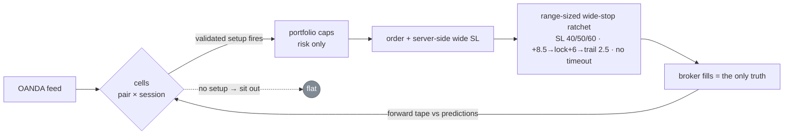

# Mr. Scrooge V6

### A forex bot with no strategy — on purpose.

*Six versions · 8 years of data · 20 pairs · 100+ strategies · 50+ indicators — boiled down to one falsifiable idea:*
**you can't predict direction, but you can price movement, size the stop to the room the market actually gives, and refuse to give a winner back.**

*An open-source algorithmic **forex trading bot** for **OANDA**, written in **Python** — with a live control-panel dashboard, a full backtesting research program, and an honest, broker-verified track record.*

 &nbsp;  &nbsp;  &nbsp; **`forward test · verdict pending`**

<!-- LIVE_BALANCE_START -->

 -f85149?style=flat-square)  -58a6ff?style=flat-square)

> **Live track record of the *current* configuration** — range-sized wide-stop ratchet · SL 40/50/60 · engage +8.5 → lock +6 → trail 2.5 fixed (7.5→8.5 on 2026-07-19) + Party Package popper grids (V6.1), live since 2026-07-16 (24 popper trades in the record), auto-updated hourly from **broker-verified fills** ([trades](livelog/trades.csv) · [equity](livelog/equity.csv)). Small sample, honest record. Prior configs and the −84% research tuition are a different story — [read the history](docs/SCROOGE_HISTORY.md). Practice account, not real money.
<!-- LIVE_BALANCE_END -->

---

## The tape — what the tuition cost

Everything here was paid for on one practice account, and we publish its tape rather than curate it. It opened at **$100,000 (Mar 22, 2026)** and bottomed at **$15,598 (Jun 10, 2026)** — an **−84% drawdown** across the V1→V4 strategy eras. That number is the strongest argument in this repo: five versions of increasingly careful research could not out-predict the market. V5's measurement overhaul (broker-fill truth, cell-era falsification discipline) stopped the bleeding; whether the wide-stop book can climb is the open forward experiment.

## The game — house, not gambler

Most bots wager that some indicator reveals *which way* price will go. We spent five versions proving it doesn't: **across three independent methods, entry features predicted WHEN price moves and HOW FAR — never WHICH WAY** (0 of 144 feature×cell combos carried signed direction). So V6 plays the house's game:

- **Trade only where the table is measured.** The unit is the **cell** — one (pair × session), profiled from 8 years of broker-anchored fills: how far price travels, how often, how fast, what the round-trip toll costs.
- **Enter on presumed *movement*, never presumed *direction*.** A cell trades only when a **validated setup** fires — mostly volatility-timing (`atr_5m` is the master knob), side set by measured persistence. No setup → no trade. That's the whole "strategy."
- **Let the exit earn — and give it room.** The only edge that survived audit lives in stops wide enough that noise doesn't kill a slow winner, plus a ratchet that locks green once a move proves itself.
- **Wide stops, after a hard lesson.** The old tighten-to-winners'-MAE dial-in was **survivorship-biased** — MAE was measured only on trades that survived to win, blind to the ones a tight stop would have killed first. An 8-yr head-to-head: tight book blew up, wide book profited.
- **One exit engine, everywhere.** A range-sized wide-stop ratchet: SL **40 / 50 / 60 pips** by session swing; trigger **+8.5 → lock +6 → trail 2.5 fixed**; **no timeout**. Brackets removed so runners can express. ([B-090](docs/BOOK_OF_BUGS.md) killed an ATR-scaled trail that gave green back as red.)
- **Party Package (V6.1, forward experiment).** Every parent trade hangs a **re-arming grid of "poppers"**: independent same-direction trades fired every 15p of adverse movement, each with its own 60p server-side SL and its own ratchet (+8.5 → lock +6 → trail 2.5). One popper per level at a time; a level re-arms only after its popper clears and price re-crosses it, so oscillating tape harvests repeatedly without stacking duplicates. Simulated verdict on our cost model: the grid gross-harvests ~+100–150p/parent and pays *more* than that in spread+slippage toll — this deployment is the live practice-tape test of exactly that claim ([full paper: hypothesis → ten falsification rounds → why it shipped anyway](docs/papers/PAPER_party_package_scale_in_2026-07-19.md)). **Don't like the strategy? Turn it off**: global kill switch + per-cell opt-out toggles on the dashboard (`config/pp_config.json`, hot-reloaded). Every popper is tagged `pp_v1` for broker-truth attribution.
- **Portfolio caps are risk only, no alpha:** `max_concurrent = 8` (parents + poppers), `max_per_currency_direction = 4`, 10% of balance notional per trade, ~80% total exposure ceiling.

## The pipeline

*Book today: 29 validated setups across 14 cells — 11 active (● live · ◐ shadow-validating · — dormant, awaiting monthly refit). Exit gear book-wide: engage +8.5 → lock +6 → trail 2.5.*

## What we falsified

Five edge families died at the same wall — on retail OANDA majors, no price-*prediction* edge cleared cost — then a sixth move revised the exit itself. Full write-ups: **[docs/papers/PAPER_edge_hunt_falsifications_2026-07-14.md](docs/papers/PAPER_edge_hunt_falsifications_2026-07-14.md)**.

| edge family | verdict |
|---|---|
| M5 scalping | edge ≈ its own transaction cost |
| Single-pair daily trend | a coin flip |
| Diversified retail TSM | real edge, but needs institutional breadth/cheap execution — net Sharpe −0.22 on our venue |
| Symmetric both-sides straddle | you always own the loser |
| Tight-stop-and-reverse | the "asymmetry" was realized direction, not a selectable property |
| **→ the turn** | tighten-to-MAE dial-in was **survivorship-biased** → the wide-stop book |
| Wide-stop book (H6, pre-registered WF) | gross Sharpe 1.26 real, **net 0.03** — the edge equals the execution toll ([paper](docs/papers/PAPER_h6_walkforward_2026-07-16.md)) |
| Scale-in / popper grids (10 rounds) | gross harvest ~+100–150p/parent is **real**; toll ~130–190p is bigger; the majors are **first-passage fair** at every lock level ([paper](docs/papers/PAPER_party_package_scale_in_2026-07-19.md)) |

## The forward tests now running

Everything live is a **forward experiment on a practice account**, scored against **broker fills**
(never our own logs), per configuration, at n≥20 before any verdict — no aggregate blending across eras.

1. **The wide-stop parent book** — the decisive walk-forward has since run and
   [falsified the level](docs/papers/PAPER_h6_walkforward_2026-07-16.md): gross Sharpe 1.26,
   **net 0.03** after realistic slippage. The edge is real and exactly the size of the toll;
   the system clears its bar only if round-trip slippage ≤ ~0.4p. The practice tape is the
   standing measurement of that knife-edge.
2. **The t20 wider-engage shadow** — the one material positive in the ledger (blind-test
   Sharpe +0.57, avg green +8 → +22p, zero overfit gap), running as a scored shadow.
3. **The Party Package (V6.1)** — re-arming popper grids, deployed *against* its own sim
   verdict on purpose: ten falsification rounds say the grid gross-harvests ~+100–150p/parent
   and pays more in toll ([paper](docs/papers/PAPER_party_package_scale_in_2026-07-19.md)).
   Every popper is broker-tagged (`pp_v1`), so real fills will confirm or refute the *cost
   model itself* — the one variable no offline sim can settle. Per-cell opt-out + global kill
   switch on the dashboard.

Details: [docs/RESEARCH_PROGRAM.md](docs/RESEARCH_PROGRAM.md), [docs/ROADMAP.md](docs/ROADMAP.md).

## Read the research

| | |
|---|---|
| 🧭 **[Research Program](docs/RESEARCH_PROGRAM.md)** | **start here** — the falsification method, open questions |
| 📜 **[History V1→V6](docs/SCROOGE_HISTORY.md)** | every version, the edge-hunt arc, the survivorship turn |
| 🐛 **[Book of Bugs](docs/BOOK_OF_BUGS.md)** | B-001→B-090 — every dead end and defect, on purpose |
| 📄 **[Papers index](docs/papers/)** | incl. the [cost-aware exit-classes paper](docs/PAPER_cost_aware_exit_classes_2026-07-05.md) (the chapter the wide-stop turn revised) |
| 🔬 **[Research & data index](research/README.md)** | corpora, retired modules, the strategy graveyard |
| 📦 **[The Archive (Dropbox)](https://www.dropbox.com/scl/fo/uyjwoj274ndzqg98ol72p/AEB6zn4q-jFexhZxVmYFRyc?rlkey=a06ocaqxuyz4at1dfkjmww1i9&st=kup4s0x9&dl=0)** | the readable research record — papers, session notes, backtest results & version history (raw corpora / models / code are privately archived, available on request) |
| ⚙️ **[Setup](docs/SETUP.md)** | from-zero install: OANDA **practice** account, venv, credentials (dashboard **or** env vars), run |
| 📊 **[Dashboard](docs/DASHBOARD.md)** | the local control panel at `:8084` — read it and drive it: setup status toggles, live exit tuning, risk caps, credentials, and the trading pause |
| 🤝 **[Contributing](CONTRIBUTING.md)** | external ideas welcome, treated as untrusted input — same falsification gauntlet our own ideas face |
| ⚖️ **[License](LICENSE)** | Apache-2.0 |

*Think we're wrong? Good. [The archive](https://www.dropbox.com/scl/fo/uyjwoj274ndzqg98ol72p/AEB6zn4q-jFexhZxVmYFRyc?rlkey=a06ocaqxuyz4at1dfkjmww1i9&st=kup4s0x9&dl=0) holds the papers, notes, and backtest results; the raw corpora are available on request so you can re-run the analysis and attack the conclusions — leak-checked corpus → walk-forward → fired-trade sim → shadow → capital. Nothing reaches the live path without passing that gauntlet.*

## ☕ Support this work

I built this in the open over **hundreds of hours and millions of paid AI-coding tokens** — and I'm not rich. There's no fund or company behind it, just me putting the whole thing out there, losses and all.

If you got value from it, learned something from the falsifications, or just appreciate a trading project that shows its −84% tape instead of hiding it — consider buying me a coffee. Every bit genuinely helps, and the more support there is, the more inclined I am to keep building public projects like this one.

---

> ⚠️ **Research software on an OANDA practice account. Not financial advice. The wide-stop result is a simulation with known inflators and its live verdict is pending. Leveraged forex can lose more than your deposit. If you run this, the outcomes are yours.**
