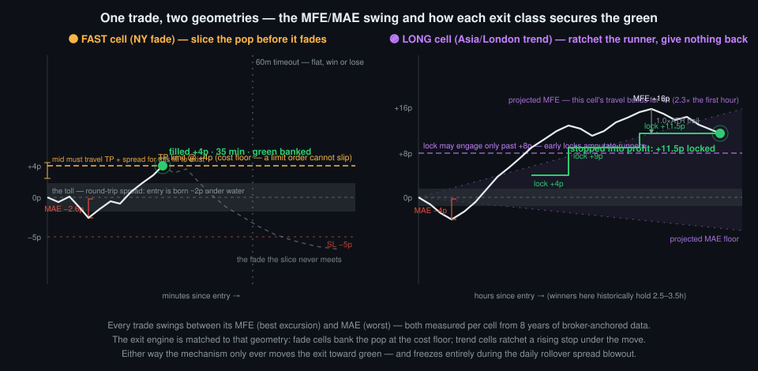
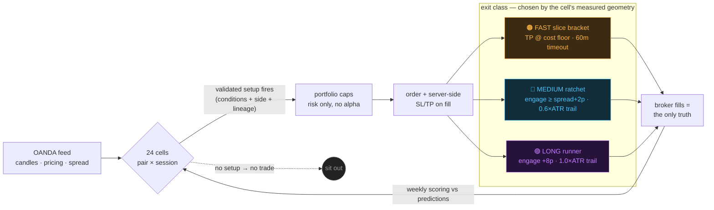

# Mr. Scrooge V6

### A forex bot with no strategy — on purpose.

*Six versions, 8 years of data, 20 pairs, 100+ strategies, 50+ indicators — boiled down to one falsifiable idea:*
**you cannot predict direction, but you can price movement, time it, and refuse to overpay for the exit.**

---

## The game theory

Most trading bots are built on a wager that the market shows its hand: that some indicator combination reveals *which way* price will go. We spent five versions and millions of bar-observations trying to win that wager. The result was one of the cleanest negative findings we've ever produced: **across three independent methods, entry-time features predicted WHEN price would move and HOW FAR — and never WHICH WAY** (final test: 0 of 144 walk-forward feature×cell combinations survived; [the paper](docs/PAPER_cost_aware_exit_classes_2026-07-05.md), [history](docs/SCROOGE_HISTORY.md)).

So V6 plays a different game — closer to how the *house* plays than how a gambler does:

1. **Trade only where the table is measured.** The unit is the **cell** — one (currency-pair × trading-session) coordinate. Each of the 24 cells is profiled from 8 years of data anchored to real broker fills: how far price typically travels there, how often, how fast, and what the round-trip toll (spread + slippage + conversion) costs.
2. **Enter on presumed momentum, never on presumed direction.** A cell trades only when a **validated setup** fires — raw-indicator conditions (mostly volatility-timing: `atr_5m` is the master knob, ρ 0.4–0.7 with forward travel in every cell) that historically preceded *movement*, with the side set by measured persistence rules. No qualifying setup → no trade. There is nothing else. That's the whole "strategy."
3. **Let the exit do the earning.** The edge that survived every audit wasn't in entries — it was in refusing to give winners back and refusing to pay tolls twice. Every trade is handed to an exit engine **tailored to its cell's measured geometry**.

## Why the exit is tailored per cell

The excursion data splits the 24 cells into three natural classes ([ratchet profile study](docs/PAPER_cost_aware_exit_classes_2026-07-05.md)):

| class | cells like | measured behavior | exit engine |
|---|---|---|---|
| 🟠 **FAST** | New York sessions (7 of 8 fast cells) | moves arrive quickly, then **fade** — travel stops growing after the first hour | **slice bracket**: server-side limit take-profit at the pair's cost floor (+3 to +5 pips — a limit order cannot slip), stop at floor+1, flat in 60 min regardless |
| 🔵 **MEDIUM** | mixed London / off-peak | ordinary extension | **spread-aware ratchet**: profit lock cannot engage below `spread + 2p` (never lock inside the toll), trail = 0.6 × entry-ATR |
| 🟣 **LONG** | Asia & London trenders | travel keeps **building for 4+ hours** (2.3× the first hour) | **runner ratchet**: no lock until +8p, wide 1.0 × ATR trail, winners historically held 2.5–3.5h |

  

And one rule for everyone: **nothing tightens or exits during the daily rollover spread blowout** (20:55–22:05 UTC, when half-spreads run 4–10× and stop fills slip up to 8.8p — we measured a "+5 pip locked win" cash out at +0.3p there once; never again).

## The pipeline

**The book right now** (● live setup · ◐ shadow-validating · — in the discovery loop):

| | Asia 22–07 UTC | London 07–13 | New York 13–22 |
|---|:---:|:---:|:---:|
| **AUD/JPY** | 🔵 — | 🔵 — | 🟠 ●● |
| **AUD/USD** | 🔵 — | 🟣 ● | 🟠 ◐ |
| **EUR/JPY** | 🟣 — | 🟠 — | 🟠 ● |
| **EUR/USD** | 🟣 — | 🔵 — | 🟠 — |
| **GBP/USD** | 🟣 ● | 🔵 ●● | 🟠 ●◐ |
| **USD/CAD** | 🔵 — | 🟣 — | 🟠 — |
| **USD/JPY** | 🟣 ● | 🟣 ● | 🔵 ◐ |
| ~~USD/CHF~~ | *pair disabled by its own scorecard, 2026-07-01* | | |

A dormant cell isn't dead — it re-enters through a monthly research refit, and a discovered setup must serve as SHADOW (logged, not traded) before it earns capital.

## How we got here — the funnel

- **20 pairs, both directions** → 7 pairs that survive their own cost-and-evidence scorecards
- **100+ strategy variants** (129 running concurrently at the V4 peak: Darvas boxes, zone tests, factor matrices, bucket-keyed ML brains) → **zero strategies**
- **50+ indicators screened** across an 8-year, ~4.4-million-bar corpus → **6 features** that carry all the surviving signal, all timing/volatility, none directional
- **The costs audit that reframed everything:** in one 5-week window, ~**83% of net losses were transaction costs** — spread, rollover slippage, conversion markup ([cost study](docs/PAPER_cost_aware_exit_classes_2026-07-05.md)). You don't fix that with a better oracle; you fix it with cost-aware exits.
- Every dead end is documented, on purpose: [the Book of Bugs, B-001→B-087](docs/BOOK_OF_BUGS.md) · [version history](docs/SCROOGE_HISTORY.md) · full research corpus, retired modules, and the strategy graveyard: **archive link at public launch**.

## Projections — as falsifiable predictions, not promises

We don't publish return projections; we publish **the numbers that must hold, and we score them weekly against broker fills** (never our own logs). The live scoreboard, from [the paper](docs/PAPER_cost_aware_exit_classes_2026-07-05.md):

| prediction | measured basis | falsified if |
|---|---|---|
| FAST slices fill within the hour 45–65% of the time | corpus fill-probability at each pair's cost floor | <35% over n≥20 |
| Failed slices lose ≤4p on average | the EV ledger's break-even ceiling (~3.5–4.5p in every cell) | >5p over n≥20 |
| Zero rollover-window exits, zero >2p-slippage stop fills | the freeze + entry-cutoff design | any |
| FAST winners resolve <45m; LONG winners >90m | excursion-class geometry | ordering inverts |
| Net expectancy per slice > 0 after all costs | cost floors + fill odds | negative over n≥30 |

If the numbers fail, the design changes — that loop (measure → falsify → rewire) *is* the product. It has already killed two exit systems, one signal stack, 129 strategies, and a currency pair.

## Run it / read it / challenge it

**[Setup](docs/SETUP.md)** · **[Architecture](docs/ARCHITECTURE.md)** · **[Modules + health panel](docs/MODULES.md)** · **[Configuration](docs/CONFIGURATION.md)** · **[Exit engines](docs/RATCHET.md)** · **[Audit ledger](docs/AUDIT_TODO.md)**

Dashboard (`:8084`): live positions with per-class management detail, the full 24-cell book with live condition values, and a **MODULES tab** — 13 red/yellow/green health checks so the bot's condition is legible at a glance.

Think we're wrong somewhere? Good. The archive ships the corpora and every retired experiment precisely so you can re-run the analysis and attack the conclusions — the same gauntlet our own ideas face (leak-checked corpus → walk-forward → fired-trade simulation → shadow → capital).

> ⚠️ **Research software on a practice account. Not financial advice. Leveraged forex can lose more than your deposit. If you run this, the outcomes are yours.**
