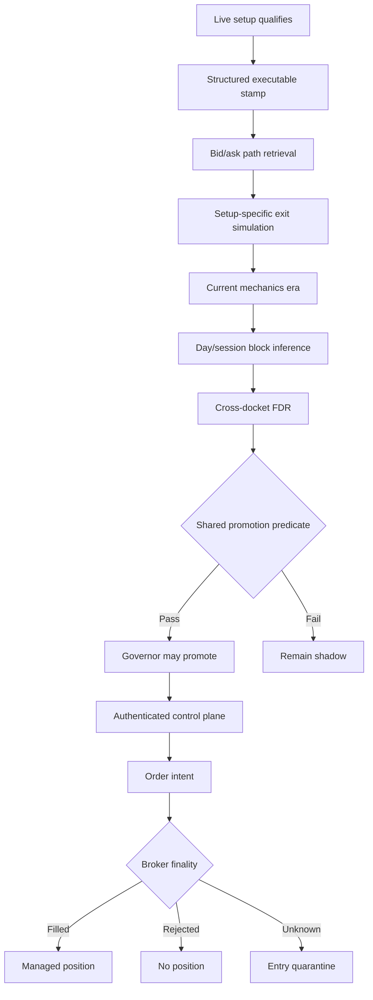

# Scrooge V6 — Proposed Code Changes

**Target reviewed:** `BrockStar3540/mr-scrooge-v6` at `293bb0d`  
**Purpose:** Implementation-ready hardening plan for configuration safety, test isolation, governor statistics, shadow execution truth, order finality, and dashboard security.

---

## 1. Objectives

This change set should:

1. Reject structurally invalid cell configurations in the live hot-loader.
2. Eliminate last-known-good cache leakage between paths and tests.
3. Make the Shadowboard and Governor use the exact same current-era dataset and promotion predicate.
4. Replace the current “99% = deflated” language with statistically accurate terminology.
5. Add day/session-block inference and a real multiple-hypothesis decision layer.
6. Score shadow episodes from the actual stamped executable entry, not a later M5 open.
7. Evaluate shadow outcomes using the setup’s actual exit geometry.
8. Treat broker order uncertainty as a quarantined state, never “safe to retry.”
9. Reject empty parent fills just as Party Package already does.
10. Protect dashboard mutations with host allowlisting and authentication.
11. Prevent the credential verifier from transmitting an OANDA token to an arbitrary HTTPS host.

### Non-goals

This patch deliberately does **not** change:

- Signal conditions or active setup selection.
- Margin-based position sizing.
- Party Package grid economics.
- The account-level capital-risk model.
- Existing historical shadow records.

Those should be separate, reviewable changes.

---

## 2. Proposed File Map

| File | Proposed change |
|---|---|
| `config/safe_config.py` | New path-keyed last-known-good helper |
| `config/cell_schema.py` | New reusable live/CLI schema validation module |
| `config/runtime.py` | Use path-keyed LKG and strict fail-closed values |
| `modules/cells/cell.py` | Validate parsed configs before activating; retain prior valid config |
| `modules/management/party_package.py` | Use path-keyed LKG |
| `research/tools/cell_config_validator.py` | Import canonical validator instead of owning a second implementation |
| `core/trial_events.py` | Structured, versioned trial-stamp model and parser |
| `core/trial_stats.py` | Era aggregation, block inference, BH-FDR, shared predicates |
| `core/shadow_execution.py` | Setup-specific shadow exit simulation |
| `ops/shadowboard.py` | Use shared current-era aggregation and actual stamped entries |
| `ops/governor.py` | Use shared evidence results and multiple-testing decisions |
| `core/broker/oanda.py` | Typed order outcome and uncertainty reconciliation |
| `core/engine.py` | Empty-fill rejection and order quarantine |
| `ops/server.py` | Authentication, Host/Origin enforcement, OANDA host allowlist |
| `ops/panel.html` | Session-only dashboard token input |
| `requirements-dev.txt` | Add random-order and coverage tooling |
| `.github/workflows/tests.yml` | Run deterministic and randomized suites |
| `tests/` | Regression and adversarial tests described below |

---

# Part I — Configuration Safety

## 3. Path-Keyed Last-Known-Good State

### Problem

`config.runtime._lkg` and `modules.management.party_package._PP_LKG` are module-global values. Tests substitute temporary file paths, but the cached state survives after the path changes. The result is deterministic suite-order leakage:

- `tests/test_fail_closed.py` leaves a paused LKG.
- The path monkeypatch is restored.
- Party Package tests read a different path but inherit the old pause.
- Nine Party Package tests and one runtime test fail.

The same design also makes future multi-instance or alternate-config-path execution ambiguous.

### New file: `config/safe_config.py`

```python
"""Path-scoped last-known-good configuration state."""
from __future__ import annotations

from copy import deepcopy
from pathlib import Path
from threading import RLock
from typing import Generic, TypeVar

T = TypeVar("T")


class PathLKG(Generic[T]):
    def __init__(self) -> None:
        self._values: dict[str, T] = {}
        self._lock = RLock()

    @staticmethod
    def key(path: Path) -> str:
        return str(path.expanduser().resolve(strict=False))

    def remember(self, path: Path, value: T) -> T:
        with self._lock:
            self._values[self.key(path)] = deepcopy(value)
            return deepcopy(value)

    def get(self, path: Path) -> T | None:
        with self._lock:
            value = self._values.get(self.key(path))
            return deepcopy(value)

    def forget(self, path: Path | None = None) -> None:
        with self._lock:
            if path is None:
                self._values.clear()
            else:
                self._values.pop(self.key(path), None)
```

### `config/runtime.py`

Replace `_lkg: dict = {}` with:

```python
from config.safe_config import PathLKG

_runtime_lkg: PathLKG[bool] = PathLKG()
```

Replace accesses with path-scoped operations:

```python
def trading_enabled() -> bool:
    result = load_runtime()
    previous = _runtime_lkg.get(RUNTIME_PATH)

    if result["_ok"]:
        raw = result["data"].get("trading_enabled")
        value = _coerce_bool(raw)
        if value is None:
            _warn_once(
                "runtime.json trading_enabled is malformed — "
                "FAILING CLOSED (last-known-good or paused)"
            )
            return previous if previous is not None else False
        return _runtime_lkg.remember(RUNTIME_PATH, value)

    if result.get("missing"):
        return previous if previous is not None else True

    return previous if previous is not None else False
```

The key behavior is:

- Missing, never configured file: `True`.
- Malformed value such as `null`: LKG, otherwise `False`.
- Unreadable file: LKG, otherwise `False`.
- A cached value from another path is irrelevant.

### `modules/management/party_package.py`

Replace `_PP_LKG` with:

```python
_pp_lkg: PathLKG[dict] = PathLKG()
```

Then:

```python
def pp_config() -> dict:
    try:
        cfg = _read_and_validate_pp_config(_CONFIG_PATH)
        return _pp_lkg.remember(_CONFIG_PATH, cfg)
    except (OSError, ValueError, TypeError, json.JSONDecodeError) as exc:
        previous = _pp_lkg.get(_CONFIG_PATH)
        if previous is not None:
            return previous
        log.warning(
            "pp_config unreadable (%s) with no LKG — poppers disabled", exc
        )
        return {**_DEFAULTS, "enabled": False}
```

### Tests

Add an autouse fixture:

```python
@pytest.fixture(autouse=True)
def reset_config_lkg():
    runtime._runtime_lkg.forget()
    ppm._pp_lkg.forget()
    yield
    runtime._runtime_lkg.forget()
    ppm._pp_lkg.forget()
```

Correct the contradictory expectation:

```python
@pytest.mark.parametrize("value,expected", [
    (True, True),
    (False, False),
    (1, True),
    (0, False),
    ("true", True),
    ("off", False),
    ("yes", True),
    (None, False),  # malformed with no LKG must fail closed
])
```

Add `pytest-randomly`:

```text
pytest-randomly>=3.15
pytest-cov>=5.0
```

CI should execute both:

```yaml
- name: Run deterministic suite
  run: python -m pytest -q tests

- name: Run randomized suite
  run: python -m pytest -q tests --randomly-seed=$(date +%s)
```

---

## 4. Live Structural Validation

### Problem

The repository test validates committed cell files, but the live loader only proves that a file is readable JSON. A manual hot edit such as:

```json
{"status": "ACTVE"}
```

or:

```json
{"exit": {"trail_pisp": 2.5}}
```

can reach the engine before CI evaluates it.

### Design

The CLI validator should not be imported from `research/tools/` by production code. Move the reusable schema functions into `config/cell_schema.py`. Both the CLI and live loader import the same implementation.

### New API

```python
"""Canonical cell-configuration validation used by runtime and tooling."""
from __future__ import annotations

from dataclasses import dataclass
from pathlib import Path
from typing import Any


@dataclass(frozen=True)
class SchemaResult:
    errors: tuple[str, ...]

    @property
    def ok(self) -> bool:
        return not self.errors


def validate_pair_config(data: Any, source: str | Path = "<memory>") -> SchemaResult:
    errors = ValidationErrors(str(source))
    _validate_document(data, errors)
    return SchemaResult(tuple(errors.errors))
```

### Hot-loader behavior

Do not discard the last valid cell configuration because a hot edit is malformed.

```python
_config_cache: dict[str, _LoadedConfig] = {}
_failed_mtime: dict[str, float] = {}


def _load_pair_config(pair: str) -> dict | None:
    path = _CELLS_DIR / f"{pair}.json"

    try:
        mtime = path.stat().st_mtime
    except OSError as exc:
        _warn_config_failure(pair, path, exc)
        cached = _config_cache.get(pair)
        return cached.data if cached else None

    cached = _config_cache.get(pair)
    if cached is not None and cached.mtime == mtime:
        return cached.data
    if _failed_mtime.get(pair) == mtime:
        return cached.data if cached else None

    try:
        data = json.loads(path.read_text(encoding="utf-8"))
        result = validate_pair_config(data, path)
        if not result.ok:
            raise ValueError("; ".join(result.errors[:10]))
    except (OSError, json.JSONDecodeError, ValueError) as exc:
        _failed_mtime[pair] = mtime
        _warn_config_failure(pair, path, exc)
        return cached.data if cached else None

    loaded = _LoadedConfig(data=data, mtime=mtime, path=path)
    _config_cache[pair] = loaded
    _failed_mtime.pop(pair, None)
    return loaded.data
```

### Acceptance tests

1. Valid initial file loads.
2. Invalid JSON retains prior valid config.
3. Structurally invalid JSON retains prior valid config.
4. Invalid first-ever file disables the pair.
5. Corrected mtime loads successfully.
6. Unknown setup fields are rejected.
7. Invalid status is rejected.
8. A schema change requires runtime tests and CLI tests in the same commit.

---

# Part II — One Statistical Truth

## 5. Stop Calling `z=2.33` “Deflated”

### Problem

The hypothesis registry reports `M_ever`, but the value does not influence the decision threshold. A fixed `z=2.33` is a 99% per-test bound, not a multiple-testing correction and not the Deflated Sharpe Ratio.

### Immediate correction

Rename:

- `z_promote` → `per_test_z`
- “deflated LCB” → “overlap-adjusted LCB”
- “Deflated Sharpe” → reserve for a future implementation using the actual trial distribution

Preserve `z_promote` as a deprecated config alias for one release:

```python
per_test_z = float(cfg.get("per_test_z", cfg.get("z_promote", 2.33)))
```

### New decision hierarchy

A setup may be promoted only if all are true:

1. `raw_n >= min_raw_episodes`
2. `independent_days >= min_independent_days`
3. `net_avg >= bar_avg`
4. `block_lcb > 0`
5. `recent_avg >= recent_min`
6. `bh_q <= fdr_q`
7. No active quarantine or data-integrity fault

Suggested defaults:

```json
{
  "min_raw_episodes": 20,
  "min_independent_days": 10,
  "bar_avg": 2.0,
  "recent_n": 5,
  "recent_min": 0.0,
  "bootstrap_reps": 10000,
  "fdr_q": 0.05
}
```

Twenty independent days would be stronger, but ten provides a practical first stage while the forward docket grows.

---

## 6. Day/Session-Block Bootstrap

### Why

The present gap-weighted `n_eff` is useful as a dashboard diagnostic, but it is not a sampling distribution. Volatility and liquidity cluster within sessions and days. Resampling complete day/session blocks retains much more of that dependence.

### Proposed data model

```python
@dataclass(frozen=True)
class TrialObservation:
    key: tuple[str, str, str]  # pair, session, setup
    timestamp: datetime
    block_id: str              # e.g. "2026-07-28|ny"
    net_pips: float
    metric_version: str
```

### Bootstrap implementation

```python
from collections import defaultdict
from dataclasses import dataclass
import hashlib
import random
import statistics


@dataclass(frozen=True)
class BlockInference:
    mean: float
    lcb: float | None
    p_value: float | None
    independent_blocks: int


def block_bootstrap_mean(
    observations: list[TrialObservation],
    *,
    null_mean: float = 0.0,
    confidence: float = 0.95,
    reps: int = 10_000,
) -> BlockInference:
    groups: dict[str, list[float]] = defaultdict(list)
    for obs in observations:
        groups[obs.block_id].append(obs.net_pips)

    block_means = [statistics.fmean(v) for v in groups.values()]
    if len(block_means) < 2:
        return BlockInference(
            mean=statistics.fmean(block_means) if block_means else 0.0,
            lcb=None,
            p_value=None,
            independent_blocks=len(block_means),
        )

    seed_material = "|".join(sorted(groups)).encode()
    seed = int.from_bytes(hashlib.sha256(seed_material).digest()[:8], "big")
    rng = random.Random(seed)
    n = len(block_means)
    samples = []

    for _ in range(reps):
        draw = [block_means[rng.randrange(n)] for _ in range(n)]
        samples.append(statistics.fmean(draw))

    samples.sort()
    alpha = 1.0 - confidence
    lcb = samples[max(0, int(alpha * reps) - 1)]

    # One-sided bootstrap probability of failing to clear the null.
    p_value = (1 + sum(x <= null_mean for x in samples)) / (reps + 1)

    return BlockInference(
        mean=statistics.fmean(block_means),
        lcb=lcb,
        p_value=p_value,
        independent_blocks=n,
    )
```

`effective_n()` can remain for display, but it must not be the primary promotion denominator.

---

## 7. Benjamini–Hochberg Across the Daily Docket

### Problem

The current registry count is printed but does not change any decision. A multiple-testing layer must operate across the actual set of candidate hypotheses evaluated during that run.

### Implementation

```python
def benjamini_hochberg(
    p_values: dict[tuple[str, str, str], float],
) -> dict[tuple[str, str, str], float]:
    """Return monotone BH-adjusted q-values."""
    ranked = sorted(p_values.items(), key=lambda item: item[1])
    m = len(ranked)
    adjusted: dict[tuple[str, str, str], float] = {}
    running = 1.0

    for rank_from_end, (key, p_value) in enumerate(reversed(ranked), start=1):
        rank = m - rank_from_end + 1
        running = min(running, p_value * m / rank)
        adjusted[key] = min(1.0, running)

    return adjusted
```

Governor flow:

```python
candidate_stats = build_candidate_stats(...)
p_values = {
    key: stats.block.p_value
    for key, stats in candidate_stats.items()
    if stats.block.p_value is not None
}
q_values = benjamini_hochberg(p_values)

for key, stats in candidate_stats.items():
    stats.q_value = q_values.get(key)
    stats.promotable = promotion_predicate(stats, cfg)
```

### Sequential peeking

BH-FDR controls the run’s cross-section, not indefinite daily re-testing. Add:

- `last_evaluated_block_count` per setup.
- Reconsider a failed setup only when at least one new independent block exists.
- Promote at a fixed cadence, preferably weekly.
- Continue daily demotion/risk checks.

Recommended governor switches:

```json
{
  "allow_promotions": false,
  "allow_demotions": true
}
```

Keep automatic promotions disabled until the shared evidence engine and shadow-exit simulation are deployed and verified.

---

## 8. One Shared Era-Aware Evidence Engine

### Problem

The Governor filters by each setup’s era clock. The Shadowboard aggregates lifetime episodes. Its `bar_met` flag checks only raw `n` and average, omitting LCB, recent performance, and era filtering.

The dashboard can therefore display a trophy for a setup the Governor would reject.

### Design

Move all evidence selection and decision logic into `core/trial_stats.py` or a new `core/trial_evidence.py`.

```python
@dataclass
class SetupEvidence:
    key: tuple[str, str, str]
    raw_n: int
    effective_n: float
    independent_days: int
    net_avg: float | None
    recent_n: int
    recent_avg: float | None
    block_lcb: float | None
    p_value: float | None
    q_value: float | None
    promotable: bool = False
    reason_codes: tuple[str, ...] = ()


def current_era_evidence(
    episodes: dict,
    book_map: dict,
    governor_state: dict,
    governor_cfg: dict,
) -> dict[tuple[str, str, str], SetupEvidence]:
    """Single source of truth used by Governor and Shadowboard."""
```

The promotion predicate must also be shared:

```python
def promotion_predicate(e: SetupEvidence, cfg: dict) -> tuple[bool, tuple[str, ...]]:
    failures = []

    if e.raw_n < cfg["min_raw_episodes"]:
        failures.append("RAW_N")
    if e.independent_days < cfg["min_independent_days"]:
        failures.append("INDEPENDENT_DAYS")
    if e.net_avg is None or e.net_avg < cfg["bar_avg"]:
        failures.append("AVG")
    if e.block_lcb is None or e.block_lcb <= cfg["lcb_min"]:
        failures.append("LCB")
    if (
        e.recent_n >= cfg["recent_n"]
        and e.recent_avg is not None
        and e.recent_avg < cfg["recent_min"]
    ):
        failures.append("RECENT")
    if e.q_value is None or e.q_value > cfg["fdr_q"]:
        failures.append("FDR")

    return not failures, tuple(failures)
```

### Shadowboard output

Expose two separate concepts:

```json
{
  "current_era": {
    "n": 24,
    "independent_days": 11,
    "avg": 3.2,
    "lcb": 0.8,
    "q": 0.031,
    "promotable": true
  },
  "lifetime": {
    "n": 91,
    "avg": 1.4
  }
}
```

Only `current_era.promotable` may generate a trophy.

The lifetime numbers remain useful research context but must never govern capital.

---

# Part III — Shadow Execution Truth

## 9. Versioned Structured Trial Stamps

### Problem

Current stamps are parsed from free-form log tokens. They record spread but not the actual executable entry. Scoring later starts from the first returned M5 candle open, which may be several minutes after the decision.

### Proposed event

Log one structured JSON object:

```python
from core.trial_events import TrialStamp

entry = view.ask if side == "long" else view.bid
stamp = TrialStamp(
    version=2,
    timestamp=now,
    pair=self.pair,
    session=self.session,
    setup_id=setup_id,
    side=side,
    status=stamp_status,
    bid=float(view.bid),
    ask=float(view.ask),
    entry=float(entry),
    spread_pips=float(view.spread_pips),
    horizon_min=int(setup.get("horizon_min", 240)),
    exit_config=dict(setup.get("exit") or {}),
    mechanics_hash=mechanics_hash(setup),
)
log.info("TRIALSTAMP %s", stamp.to_json())
```

Suggested model:

```python
@dataclass(frozen=True)
class TrialStamp:
    version: int
    timestamp: datetime
    pair: str
    session: str
    setup_id: str
    side: str
    status: str
    bid: float
    ask: float
    entry: float
    spread_pips: float
    horizon_min: int
    exit_config: dict
    mechanics_hash: str
```

Maintain a legacy parser for historical `CELLSHADOW` records. Mark them:

```json
{"metric_version": "legacy-mid-v1"}
```

New records:

```json
{"metric_version": "executable-exit-v2"}
```

Do not mix metric versions inside the same promotion sample.

---

## 10. Bid/Ask Candle Retrieval

Request bid and ask candles:

```text
price=BA
```

For a long:

- Entry is the stamped ask.
- Liquidation path is bid.

For a short:

- Entry is the stamped bid.
- Liquidation path is ask.

```python
def executable_candle(candle: dict, side: str) -> dict[str, float]:
    component = candle["bid"] if side == "long" else candle["ask"]
    return {
        "open": float(component["o"]),
        "high": float(component["h"]),
        "low": float(component["l"]),
        "close": float(component["c"]),
    }
```

The entry must always remain `stamp.entry`; never replace it with a candle open.

---

## 11. Setup-Specific Shadow Exit Simulation

### Problem

A fixed 240-minute close measures directional drift, not the strategy being promoted. Live demotion observes ratchet/bracket results, creating a different payoff distribution.

### Proposed API

```python
@dataclass(frozen=True)
class ShadowOutcome:
    net_pips: float
    exit_reason: str
    exit_time: datetime
    mfe_pips: float
    mae_pips: float
    ambiguous_bar: bool
    metric_version: str = "executable-exit-v2"


def simulate_shadow_exit(
    stamp: TrialStamp,
    candles: list[dict],
) -> ShadowOutcome:
    mode = stamp.exit_config.get("mode", "ratchet")
    if mode == "bracket":
        return simulate_bracket(stamp, candles)
    return simulate_ratchet(stamp, candles)
```

### Intrabar ambiguity rule

M5 candles do not reveal event order inside a bar. If both a favorable trigger and adverse stop could have occurred within the same candle:

- Use the adverse/worst-case outcome for promotion evidence.
- Set `ambiguous_bar=true`.
- Track the ambiguity rate.

This is conservative and prevents OHLC path assumptions from manufacturing edge.

Later, replace M5 simulation with captured quote-stream replay for the 8.5-pip ratchet.

### Promotion sample rule

Only episodes with:

- `metric_version == current configured metric version`
- matching `mechanics_hash`
- complete outcome
- valid bid/ask data

may enter the promotion sample.

---

# Part IV — Order Finality

## 12. Do Not Treat Broker Uncertainty as “Not Placed”

### Problem

Current code:

- Catches `HTTPError` through the broader `URLError` branch.
- Sleeps once.
- Treats `404`, `PENDING`, or any non-`FILLED` state as not placed.

A delivered-but-not-yet-queryable order can therefore be retried as a new intent.

### New result types

```python
from dataclasses import dataclass
from enum import Enum


class OrderState(Enum):
    FILLED = "filled"
    REJECTED = "rejected"
    UNKNOWN = "unknown"


@dataclass(frozen=True)
class OrderOutcome:
    state: OrderState
    intent_id: str
    trade_id: str | None = None
    fill_price: float | None = None
    raw: dict | None = None


class OrderUncertain(RuntimeError):
    def __init__(self, intent_id: str, message: str):
        super().__init__(message)
        self.intent_id = intent_id
```

### Exception ordering

```python
try:
    result = self._req("POST", path, {"order": order})
except urllib.error.HTTPError:
    # Broker responded. This is a rejection/business response, not transport loss.
    raise
except (TimeoutError, socket.timeout, ConnectionError, urllib.error.URLError) as exc:
    outcome = self._reconcile_order(intent_id)
    if outcome.state is OrderState.FILLED:
        return outcome
    if outcome.state is OrderState.REJECTED:
        return outcome
    raise OrderUncertain(
        intent_id,
        f"order outcome unresolved after transport failure: {exc}",
    ) from exc
```

### Reconciliation

```python
def _reconcile_order(self, intent_id: str) -> OrderOutcome:
    delays = (0.5, 1.0, 2.0, 4.0, 8.0)

    for delay in delays:
        time.sleep(delay)
        try:
            response = self._req(
                "GET",
                f"/v3/accounts/{self._acct}/orders/@{intent_id}",
            )
        except urllib.error.HTTPError as exc:
            if exc.code == 404:
                continue  # not proof of non-delivery yet
            raise

        order = response.get("order") or {}
        state = order.get("state")

        if state == "FILLED":
            return self._adopt_reconciled_fill(intent_id, order)
        if state in {"CANCELLED", "REJECTED"}:
            return OrderOutcome(
                state=OrderState.REJECTED,
                intent_id=intent_id,
                raw=response,
            )

        # PENDING/TRIGGERED/unknown: continue polling, never classify as absent.

    return OrderOutcome(state=OrderState.UNKNOWN, intent_id=intent_id)
```

### Engine quarantine

```python
class Engine:
    order_quarantine: dict[str, datetime]

    def _open_trade(...):
        try:
            outcome = self.broker.place_market(...)
        except OrderUncertain as exc:
            self.order_quarantine[exc.intent_id] = now
            log.critical(
                "ORDER QUARANTINE intent=%s — new entries disabled pending broker reconciliation",
                exc.intent_id,
            )
            return
```

The portfolio entry gate must reject all new orders while `order_quarantine` is non-empty. Position management continues.

A background reconciliation pass should resolve quarantined IDs against:

- Orders by client ID.
- Open trades by client extensions.
- Transactions since the intent timestamp.

An operator can clear a quarantine only after the broker state proves the outcome.

---

## 13. Reject Empty Parent Fills

Party Package already rejects empty trade IDs. Apply the same rule before building a parent `Position`:

```python
trade_id = str(outcome.trade_id or "")
if not trade_id:
    raise RuntimeError(
        f"broker returned no filled trade for {ticket.pair}; "
        f"intent={outcome.intent_id}"
    )
```

Never allow:

```python
Position(oanda_trade_id="")
```

### Tests

1. HTTP 400 is not treated as transport failure.
2. Timeout then fill adopts the broker trade.
3. Timeout then cancel returns rejected.
4. Timeout then repeated 404 produces `OrderUncertain`.
5. `PENDING` produces `OrderUncertain`, not “safe to retry.”
6. Empty parent trade ID creates no manager.
7. Quarantine blocks new entries but not management.
8. Restart recovery can resolve a quarantined intent.

---

# Part V — Dashboard Security

## 14. Security Model

### Localhost mode

- Default bind remains `127.0.0.1`.
- Mutating requests require a dashboard token.
- Requests must use an allowed Host.
- Browser requests must be same-origin.

### Non-loopback mode

The dashboard must refuse startup unless:

- `DASHBOARD_TOKEN` is configured with adequate entropy, and
- `DASHBOARD_ALLOWED_HOSTS` is configured, and
- the operator explicitly sets `DASHBOARD_ALLOW_REMOTE=1`.

TLS should be terminated by an authenticated reverse proxy.

---

## 15. Host Allowlisting

Current Origin-versus-Host equality does not defeat DNS rebinding. A rebinding domain produces matching values.

```python
from ipaddress import ip_address
from urllib.parse import urlsplit


def dashboard_allowed_hosts(bind_host: str, port: int) -> set[str]:
    configured = {
        item.strip().lower()
        for item in os.environ.get("DASHBOARD_ALLOWED_HOSTS", "").split(",")
        if item.strip()
    }
    defaults = {
        f"localhost:{port}",
        f"127.0.0.1:{port}",
        f"[::1]:{port}",
    }
    if bind_host not in {"127.0.0.1", "::1", "localhost"}:
        return configured
    return defaults | configured
```

Handler:

```python
def _host_allowed(self) -> bool:
    host = self.headers.get("Host", "").strip().lower()
    return host in self.server.allowed_hosts


def _origin_allowed(self) -> bool:
    origin = self.headers.get("Origin")
    if not origin:
        return self.client_address[0] in {"127.0.0.1", "::1"}

    parsed = urlsplit(origin)
    if parsed.scheme not in {"http", "https"}:
        return False
    return parsed.netloc.lower() in self.server.allowed_hosts
```

Host allowlisting must execute before route dispatch for both GET and POST.

---

## 16. Dashboard Authentication

### Environment

```text
DASHBOARD_TOKEN=<at least 32 random bytes>
```

Generate:

```bash
python -c "import secrets; print(secrets.token_urlsafe(32))"
```

### Server check

```python
import secrets


def _authenticated(self) -> bool:
    expected = os.environ.get("DASHBOARD_TOKEN", "")
    if not expected:
        return False

    supplied = self.headers.get("X-Scrooge-Token", "")
    return bool(supplied) and secrets.compare_digest(supplied, expected)
```

Mutating routes require all three:

```python
if not self._host_allowed():
    return self._deny(421, "host rejected")
if not self._origin_allowed():
    return self._deny(403, "origin rejected")
if not self._authenticated():
    return self._deny(401, "authentication required")
```

Sensitive GET routes such as credentials, mode, full account state, and configuration should also require authentication.

### Panel

- Prompt once for the token.
- Store it in `sessionStorage`, never `localStorage`.
- Attach `X-Scrooge-Token` to API calls.
- Clear it when the tab closes.
- Never echo it into logs or HTML.

```javascript
function dashboardToken() {
  let token = sessionStorage.getItem("scrooge.dashboard.token");
  if (!token) {
    token = prompt("Dashboard access token") || "";
    if (token) sessionStorage.setItem("scrooge.dashboard.token", token);
  }
  return token;
}

async function apiFetch(url, options = {}) {
  const headers = new Headers(options.headers || {});
  headers.set("X-Scrooge-Token", dashboardToken());
  return fetch(url, {...options, headers});
}
```

For stronger browser security, replace the header flow later with a `/login` exchange and an `HttpOnly`, `SameSite=Strict`, `Secure` session cookie.

---

## 17. OANDA API Host Allowlist

### Problem

The dashboard accepts any valid HTTPS URL and sends the bearer token to:

```text
{submitted_host}/v3/accounts
```

A malicious host can return an OANDA-shaped response and retain the token.

### Safe rule

Dashboard-submitted credentials may use only exact approved hosts:

```python
OFFICIAL_OANDA_HOSTS = {
    "https://api-fxpractice.oanda.com",
    "https://api-fxtrade.oanda.com",
}


def allowed_oanda_api_url(url: str, mode: str) -> bool:
    normalized = url.strip().rstrip("/")
    expected = (
        "https://api-fxtrade.oanda.com"
        if mode == "live"
        else "https://api-fxpractice.oanda.com"
    )
    return normalized == expected
```

If laboratory mocks or regional hosts are required, configure them at process startup:

```text
SCROOGE_OANDA_HOST_ALLOWLIST=https://approved.internal.example
```

Do not allow a dashboard POST to expand that list.

Additional restrictions:

- HTTPS only.
- No embedded username/password.
- No query or fragment.
- Exact normalized hostname.
- Port must be absent or `443`.
- Resolve and reject loopback, link-local, and private IP addresses unless the host was explicitly startup-allowlisted.
- Disable redirects when sending an Authorization header, or strip Authorization on cross-host redirects.

The simplest secure production choice is to remove editable API URLs from the panel entirely.

### Tests

1. Official practice URL accepted for practice.
2. Official live URL accepted for live.
3. Practice/live cross-host mismatch rejected.
4. Arbitrary HTTPS host rejected before any network call.
5. Redirect to another host does not receive Authorization.
6. DNS-rebinding-style matching Origin/Host is rejected by Host allowlist.
7. Missing-Origin LAN request requires authentication and is rejected by default.
8. Token comparison uses constant-time comparison.
9. Non-loopback bind without remote opt-in/token/hosts refuses startup.

---

# Part VI — Documentation and Operational Migration

## 18. Configuration Changes

Suggested `config/governor_config.json`:

```json
{
  "enabled": true,
  "allow_promotions": false,
  "allow_demotions": true,
  "min_raw_episodes": 20,
  "min_independent_days": 10,
  "bar_avg": 2.0,
  "lcb_min": 0.0,
  "recent_n": 5,
  "recent_min": 0.0,
  "bootstrap_reps": 10000,
  "fdr_q": 0.05,
  "max_promotions": 2,
  "max_demotions": 4
}
```

Remove or deprecate:

```json
{
  "z_promote": 2.33
}
```

Suggested environment:

```text
DASHBOARD_HOST=127.0.0.1
DASHBOARD_ALLOWED_HOSTS=localhost:8084,127.0.0.1:8084,[::1]:8084
DASHBOARD_TOKEN=<random token>
DASHBOARD_ALLOW_REMOTE=0
```

---

## 19. Data Migration

Do not rewrite historical `data/shadowboard.json` destructively.

Migration rules:

1. Existing records without `metric_version` become `legacy-mid-v1`.
2. Existing records without stamped entry retain their existing score for lifetime display.
3. Legacy records cannot qualify under the new live promotion metric.
4. New `executable-exit-v2` evidence starts a fresh mechanics era.
5. Dashboard shows legacy lifetime evidence separately.
6. Governor writes one `METRIC-ERA-RESET` ledger record for every affected setup.

Example:

```json
{
  "t": "2026-07-28T12:00:00+00:00",
  "action": "METRIC-ERA-RESET",
  "key": "EUR_USD|london|example_setup",
  "from": "legacy-mid-v1",
  "to": "executable-exit-v2"
}
```

---

## 20. Recommended Commit Sequence

Keep this work reviewable:

1. `fix: isolate last-known-good config state`
2. `fix: enforce cell schema in live hot reload`
3. `refactor: share era-aware trial evidence`
4. `feat: add block inference and FDR decisions`
5. `feat: stamp executable shadow entries`
6. `feat: simulate setup exits for shadow trials`
7. `fix: quarantine uncertain broker orders`
8. `fix: authenticate and allowlist dashboard`
9. `test: add adversarial hardening coverage`
10. `docs: publish hardened governor and dashboard contracts`

Do not combine all changes into one unreviewable commit even if they share one PR.

---

## 21. Validation Commands

```bash
python -m pytest -q tests
python -m pytest -q tests --randomly-seed=41727
python research/tools/cell_config_validator.py config/cells/*.json
python -m pytest --cov=config --cov=core --cov=modules --cov=ops --cov-report=term-missing
ruff check config core modules ops tests
bandit -q -r config core modules ops
git diff --check
```

Add targeted fault-injection tests for:

- Config truncated during replacement.
- Config valid JSON but invalid schema.
- Dashboard malicious Host and Origin combinations.
- Credential submission to attacker-controlled HTTPS URL.
- OANDA order timeout followed by delayed visibility.
- OANDA order remaining pending.
- Empty parent fill.
- Old and new shadow metric versions.
- Mechanics-era reset.
- Random test ordering.

---

## 22. Acceptance Criteria

The patch is complete only when:

- [ ] Full suite passes from a clean clone.
- [ ] Full suite passes under randomized ordering.
- [ ] All 18 cell configurations pass the canonical schema.
- [ ] Live hot-loader rejects structurally invalid JSON and retains its previous valid config.
- [ ] `null` runtime state fails closed without relying on prior tests.
- [ ] Governor and Shadowboard call the same evidence aggregation function.
- [ ] Dashboard trophy equals the Governor promotion predicate exactly.
- [ ] Current-era and lifetime statistics are visibly separated.
- [ ] Hypothesis registry affects the actual multiple-testing decision.
- [ ] Promotion evidence is based on independent day/session blocks.
- [ ] New shadow trials start from stamped executable entries.
- [ ] New shadow trials simulate the configured exit manager.
- [ ] Metric versions never mix within a promotion sample.
- [ ] HTTP broker rejections are not treated as transport failures.
- [ ] Pending/unknown orders quarantine new entries.
- [ ] Empty parent trade IDs cannot create managers.
- [ ] Dashboard mutation requires authentication.
- [ ] Host allowlisting blocks DNS-rebinding-style requests.
- [ ] Arbitrary HTTPS API URLs are rejected before a bearer token is transmitted.
- [ ] Non-loopback dashboard startup fails without explicit secure configuration.
- [ ] No OANDA tokens, dashboard tokens, or sensitive headers appear in logs.

---

## 23. Final Architecture

After these changes, the control flow should be:



The central rule is:

> **One configuration schema, one evidence dataset, one promotion predicate, one executable-price standard, and no guessed broker state.**

